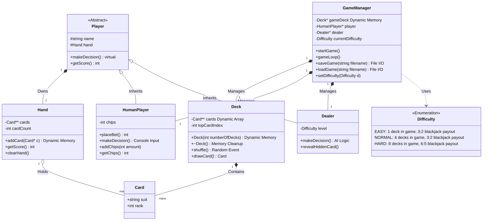

# Blackjack

C++ console blackjack game.

Features:
    - Three difficulty levels
    - Basic game flow management
    - Human and dealer player roles
    - Deck and card handling structures
    - Difficulty and game state management

## Class diagram



## Layout

| Path | Role |
|------|------|
| `include/Difficulty.h` | `Difficulty` enum |
| `include/Card.h` | `Card` |
| `include/Deck.h` | `Deck` |
| `include/Hand.h` | `Hand` |
| `include/Player.h` | abstract `Player` |
| `include/HumanPlayer.h` | `HumanPlayer` |
| `include/Dealer.h` | `Dealer` |
| `include/GameManager.h` | `GameManager` |
| `src/*.cpp` | Game logic |
| `tests/` | Catch2 test shells and [`tests/unit_test_plan.md`](tests/unit_test_plan.md) |

## Build

From the repository root:

```text
cmake -S . -B build
cmake --build build
```

The first configure downloads **Catch2** (used only for tests) unless you pass `-DBJ_BUILD_TESTS=OFF`.

## Unit tests

After a successful build, run all registered tests with **CTest** (recommended):

```text
ctest --test-dir build -C Debug --output-on-failure
```

Catch2 tag filters apply only when you invoke the binary yourself, for example:

```text
build/blackjack_tests "[deck]"
```
